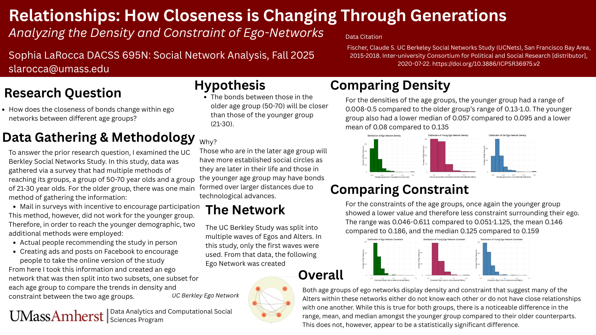

## About Me

I am currently pursuing a Master's Degree in Data Analytics and Computational Social Science at the University of Massachusetts Amherst where I have been learning first-hand how to use the data collected from various social studies to tell a story. I earned a BA in Computer Science alongside a minor in Sociology whilst in undergrad and have been translating the skills learned in those fields to data-driven research.

I have experience with a variety of different coding languages, from Python to Java to R and experience using these languages to visualize and explore the significance of data. My goal is always to try and use numbers to paint a picture of the overall scope of my questions, while still acknowledging and sharing the important parts of the individuals.

For more information regarding my technical and professional experiences examine my resume here: [SophiaLaRocca-MasterResume.docx.pdf](https://github.com/user-attachments/files/27576242/SophiaLaRocca-MasterResume.docx.pdf)

## My Projects

### Relationships: How Closeness is Changing Through Generations
This project compares how relationship closeness changes between two different age ranges of people in California.

### The Impact of Connection on United States Politics
This project examines the way that things such as religion, gender, and age can impact political ideology.
To see the project in it's entirety, please follow this link: [Impact_Of_Connection_on_Politics](assets/SophiaLaRocca_FinalProject.html)
